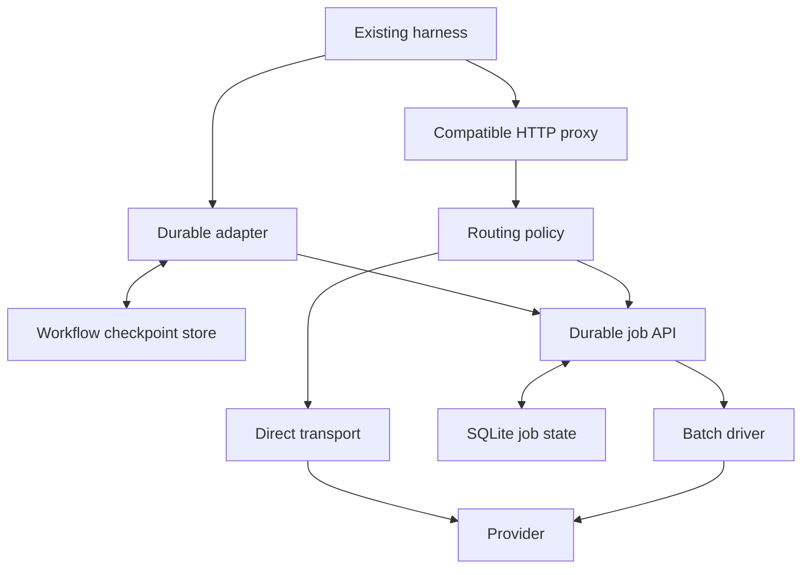

# Kaiion: durable, economical execution for existing harnesses

## Product decision

Make Kaiion the durable inference substrate under existing agents. Preserve their planning, tools, repositories, permissions, and conversation formats. Expose two integration levels: a compatible local proxy for easy adoption, and a small durable-job API for workflows that can suspend and resume. Do not build another general agent harness.

The original implementation had a strong at-most-once batch submission state machine, but it was narrower than the product thesis: Codex-specific identity, Responses SSE only, no stored request body, no detached retrieval, no unattended credential rehydration, no routing policy, and no notion of a workflow's tool state or total spending.

The highest-impact distinction is **durable inference versus durable execution**. Holding an SSE connection open is useful compatibility behavior. It cannot make a harness process, tool operation, workspace, or authorization session survive for weeks.

## Implemented in this change

| Boundary | New behavior | Remaining limit |
|---|---|---|
| Client identity | Idempotency-Key or X-Kaiion-Session-Id; existing Codex identity retained | Session-only identity cannot distinguish intentional identical calls; keys remain scoped to original credentials |
| Persistence | Request body is committed atomically with job creation; conflicting key reuse returns 409 | Original pre-migration jobs need one request replay to populate payload |
| Transport | Blocking JSON, existing SSE, or detached HTTP 202 jobs | Stock harnesses still have their own absolute timeouts and restart behavior |
| Operations | Submit/list/show/resume/wait/route CLI; authenticated job endpoints | No cancellation, operator retry protocol, retention controls, or usage ledger yet |
| Recovery | Resume by job ID; optional startup resume using environment credentials | No secret manager integration or rotation between credential namespaces |
| Economics | Deterministic, inspectable auto policy with per-model prices and direct allowances | Estimates, not billed cost; no cumulative budget reservation |
| Configuration | Client mode and generic session headers for Codex/OpenCode/Pi | Claude Code still requires native Anthropic support |

The existing ambiguous-create contract is preserved: after a possibly accepted provider submission, reconcile against provider metadata; never blindly submit again. Direct requests are still passthrough and are not promised at-most-once execution.

## Architecture to grow into

The proxy, policy, durable job API, SQLite state, and batch driver exist. The harness adapter and workflow checkpoint store are the next execution layer. The workflow store belongs alongside the harness, which knows whether a tool already ran. It should refer to Kaiion jobs rather than duplicating provider state machines.

A minimal adapter contract should carry `(workflow_id, step_id, attempt_id)` and persist:

1. The exact provider request and its idempotency key before submission.
2. The returned job ID before suspending.
3. The completed response before invoking tools.
4. Tool intent, idempotency/receipt information, and tool output before advancing the transcript.
5. Workspace/checkpoint reference, harness version, permissions, and continuation cursor.

On restart, retrieve or resume the pending inference; do not ask the model to reconstruct an interrupted turn. For a tool crash between external execution and recording the receipt, reconcile using the tool's idempotency key or ask for intervention. A generic proxy cannot manufacture exactly-once external side effects.

## Auto mode: economic model

If waiting truly has zero cost and batch is cheaper, choose batch for every eligible call. A small call is not a reason to pay more by itself. The additional objective is an explicit willingness to spend a little to make progress, preserve a warm cache, release an occupied worker, or unlock many independent branches.

For request x and execution route r, estimate:

`C_r(x) = input_uncached * price_r_uncached + input_cached * price_r_cached + output * price_r_output + cache_writes + tool_fees + execution_overhead`

Then estimate `premium = C_direct - C_batch`, and select direct only when its premium is justified by avoided holding/cache/recovery cost and the workflow's progress allowance. Keep a separate total inference budget and quality constraint. Do not silently substitute a weaker model.

The initial policy deliberately uses a smaller observable rule:

`direct iff estimated_direct_cost <= max_direct_cost AND max(0, estimated_direct_cost - estimated_batch_cost) <= max_direct_premium`

Both limits default to zero. Unknown model prices, output without an explicit limit, substantial reasoning, and unpriced modalities or hosted tools favor batch. The estimator sees all serialized instructions, history, tool definitions, and output schema, not just the last user message. The example prices are fictional and must be replaced.

For illustration, 200 input tokens plus 64 output tokens at $1/$4 per million cost $0.000456 directly and $0.000228 at a 50% discount. Paying the $0.000228 premium could be rational to discover the next parallel tasks. A 100,000-input/10,000-output-token request at the same prices costs $0.14 directly versus $0.07 in batch. These are worked examples, not current model prices.

Avoid classifying calls as “thinking” based on prose. Use explicit reasoning effort, output limits, observed usage quantiles, full context size, tool type, cache state, and optional adapter hints such as `unblocks=N`. A high reasoning setting can be a conservative batch preference; it is not itself a dollar estimate. Do not spend an extra model call classifying every request.

Batch and caching require joint modeling. Anthropic documents that batch discounts can combine with prompt caching but that cache hits are best effort. The implication is to estimate cache-hit probability separately for each route, rather than mechanically applying half the observed synchronous cost. [Anthropic batch processing](https://platform.claude.com/docs/en/build-with-claude/batch-processing), [prompt caching](https://platform.claude.com/docs/en/build-with-claude/prompt-caching).

A later learned policy should be calibrated from real usage and report prediction error. Start with offline/shadow evaluation against always-batch and always-direct baselines. Optimize cost per successfully completed workflow, not batch percentage. A higher batch percentage that causes extra retries or context reconstruction can lose money.

## Prioritized additions and acceptance criteria

### 1. A real harness continuation adapter

Build one supported end-to-end adapter before claiming general unattended execution. Prefer an existing harness with a replaceable model/provider interface. Keep tool execution, user approvals, and memory within that harness. Support waiting without keeping a process allocated, then resume the exact pending step.

Acceptance: a multi-turn, tool-using workflow completes after killing the harness and proxy independently before submission, during waiting, after inference completion, and around tool execution. No extra provider batch is created for a replay; ambiguous tool execution becomes explicit. Test real pinned harness releases as well as the fake client.

### 2. Native protocol coverage

Add Anthropic Messages + Message Batches for Claude Code; add OpenAI Chat Completions for the wider SDK/harness ecosystem. Keep protocols native through persistence and reconstruction. Translating Anthropic thinking blocks into generic text would lose semantics. Extract a provider interface when adding the second actual implementation, not an empty abstraction now.

Acceptance: text, parallel tool calls, tool results, reasoning blocks, stop reasons, usage, JSON mode, and terminal errors round-trip through each native adapter. Publish a capability matrix per model/endpoint/provider and reject unsupported features before incurring cost. Do not imply that a subscription login automatically grants Batch API access.

OpenAI documents asynchronous Batch API pricing and a 24-hour completion window; Anthropic exposes a separate Messages batch protocol. These constraints motivate detached continuations and native adapters. [OpenAI Batch API](https://developers.openai.com/api/docs/guides/batch), [Anthropic batch API](https://platform.claude.com/docs/en/api/messages/batches/create).

### 3. Workflow budgets, receipts, and bounded recovery

Add a durable cost ledger keyed by workflow and job. Reserve estimated cost atomically before dispatch, settle using provider usage, and account for retries. Separate the total budget from the extra direct-inference allowance. Pause a workflow when its remaining budget is insufficient. Estimates need explicit uncertainty; they cannot guarantee billing caps for unpriced tools or unconstrained outputs.

Add expired-job retry policies with new attempt IDs and bounded spend, cancellation reconciliation, exponential backoff with jitter/Retry-After, credential-refresh states, and operator handling for uncertain submissions. Keep uncertainty distinct from permanent failure. Add credential references resolved from environment/keychain/secret managers, with explicit ownership binding to support key rotation.

Acceptance: concurrent steps cannot overspend a reserved workflow allowance; restarts preserve reservations; cancelled/expired/ambiguous jobs cannot silently start a second paid attempt; cost reports distinguish estimated and observed usage.

### 4. Ready-work scheduling and pooling

Separate the dependency graph from provider batch files. Only ready steps may be scheduled. Pool compatible jobs by provider, credential/project, endpoint, and model constraints; never cross credential boundaries. Flush on size/byte limits or a configurable maximum age. One-entry batches already receive the endpoint's discount; pooling reduces submission/polling overhead and improves capacity utilization rather than inherently increasing the discount.

Long horizons benefit from many independent workflows or independent branches; dependent turns still wait for earlier results. Use bounded admission, fair per-workflow queues, provider token/file limits, and polling concurrency. Make delayed batches yield resources. Do not hold unbounded worker tasks or repeatedly list every upstream batch without backoff.

Acceptance: expired or malformed lines fail only their own jobs; partial result files preserve successful neighbors; retries never include completed work; cancellation does not cancel unrelated jobs; throughput tests demonstrate bounded memory and provider request rate.

### 5. Distribution and measurable adoption

Ship signed/reproducible macOS ARM, macOS Intel, and Linux release binaries, then Homebrew/package installation and service-manager templates. Add `doctor` to validate endpoints, credentials, client capabilities, and timeout settings without paid inference by default. Provide reversible client configuration and a useful dry-run diff. Offer a tiny durable-job client library, pinned harness examples, and a documented compatibility contract.

Start with visible, repeatable workloads: repository-wide migrations, documentation updates, nightly maintenance, evaluations, and broad research/code-analysis runs. Track completed workflows per dollar, recovery success, idle resource cost, setup-to-first-success time, and reasons for direct selection. Show savings using actual workload receipts; do not promise a fixed whole-workflow reduction from the advertised inference discount.

## Release boundaries

This change makes the inference layer reusable and independently recoverable. It does not yet provide a full workflow supervisor, Anthropic support, pooling, a hard total budget, or exactly-once tools. Production multi-day agent runs should be considered supported only after the real harness continuation and budget acceptance criteria above pass.
